# My mommy and me blog

[View the live project here](https://my-mommy-and-me.herokuapp.com/ "Link to deployed link - My mommy and me blog")

## Table of contents

1. [Introduction](#Introduction)

2. [UX](#UX)

	A. [Ideal User Demographic](#Ideal-User-Demographic)

	B. [User Stories](#User-Stories)

	C. [Development Plans](#Development-Plans)

	D. [Design](#Design)

3. [Features](#Features)

	A. [Existing Features](#Existing-Features)

	B. [Features to Implement in the future](#Features-to-Implement-in-the-future)

4. [Issues and Bugs](#Issues-and-bugs)

5. [Technologies Used](#Technologies-used)

	A. [Main Languages Used](#Main-Languages-Used)

	B. [Additional Languages Used](#Additional-Languages-Used)

	C. [Frameworks, Libraries & Programs Used](#Frameworks,-Libraries-&-Programs-Used)

6. [Testing](#Testing)

	A. [Testing.md](TESTING.md)

7. [Deployment](#Deployment)

8. [Credits](#Credits)

	A. [Content](#Content)

	B. [Media](#Media)

	C. [Code](#Code)

9. [Acknowledgments](#Aknowledgements)

## Introduction

My mommy and me blog was designed to displayed simple recipes for parents with their children. The site's goal is to allow users to share their recipes and experiences for other users to read and use. I got the inspiration in my 4-years-old daughter, she doesn't go to preschool once a month, and she calls our time together: "My mommy and me".

Users will also be able to comment on recipes, and upload their own images. They can like or unlike the recipe. And they will have the CRUD functionality to post recipes, so they can Create, Read, Update and Delete.

This is the fourth of five projects for completing the Full Stack Software Development program at the Code Institute.

## UX

### Ideal User Demographic

The ideal user of this website is:
• Parents
• Cooking Enthusiasts

### User Stories 

#### Users
1. As a site user I can view a paginated list of posts so that I can select one to read.
2. As a site user I can click on a recipe so that I can read the full text.
3. As a site user/ admin I can view the number of likes on each recipe so that I can see which is the most popular or viral.
4. As a site user/admin I can view comments on an individual recipe so that I can read the conversation.
5. As a site user I can register an account so that I can comment and like posts.
6. As a site user I can leave comments on a recipe so that I can be involved in the conversation.
7. As a site user I can like or unlike a recipe so that I can interact with the content.
8. As a site user I can register with other account (google, facebook, twitter) so that I can sign in quickly.
9. As a site admin I can create, read, update and delete posts so that I can manage my blog content.
10.  As a site admin I can create draft posts so that I can finish writing the content later.
11.  As a site user I can want to save my favorite recipe so that I can find them easily whenever I want.
12.  As a site user I can receive updates so that I can keep reading new recipe.
13.  As a site user I can reply comments from other users so that I can keep track of the same conversation.
14.  As a site user I can want to save my favorite recipe so that I can find them easily whenever I want.
15. As a site user I can reply comments from other users so that I can keep track of the same conversation.
16. As a site user I can view a list of posts so that I can select one to read.
17. As a site user I can see my username displayed so that I know that I log in.
18.  As a Site user I can create a profile so that I can interact with other user.
19.  As a Site user I can edit or update any recipe I posted so that I can add or change something.
20. As a Site user I can delete my own posts so that I can control the information I recipe.

#### Site Admin
1. As a site admin I can create draft posts so that I can finish writing the content later.

### Development Plans

To create an appeling website with a great UX and UI, the developer make a research throughout the best cooking blogs, with the best and worst features.

#### Strategy
- **Roles**
    - User
    - Admin

- **Demographic**
    - Parents
    - Cooking Enthusiasts

- **Psycographics**
    - Personality & Attitude:
        - Patient
        - Creative
        - Curious
    - Values:
        - Love for quality time in family
    - Lifestyle:
        - Parents
        - Interested in homemade food

The website needs to enable the *user* to:
- search for recipes.
- make comments to a recipe.
- like and unlike recipes.
- upload images from their experiences when adding a recipe.
- register and log in to participate in the blog.
- save recipes to a favorite page.

The website needs to enable the *admin* to:
- Create drafts for finishing later.

#### Scope
the scope was defined to be able to determine the work that needed to be done in terms of the features and of the strategies described.

- *Content Requirements*
The user will be expecting:
    - A comprehensive list of recipes.
    - A detailed list with ingredients and procedure.
    - A list of comments.
    - A page to find the saved recipes.

- *Functionality Requirements*
The user will be able to:
    - Navigate the site easily.
    - Select recipes for trying.
    - Add comments to every recipe.
    - Like or unlike recipes.

### Design

#### Color Scheme
The colors were chosen for a soft look of the website and focusing mainly on the images. The terra cotta gives a warm sensation and the cultured color gives a clean and clear sensation without overwhelming the user.

#### Typography
The font chosen for the heading tags was 'Architects Daughter' as it is a cool and soft typography, and for the rest of the text was 'Open Sans' as it is clear and concise for big texts.

#### Imagery
To match the color scheme, the default images for the recipes and the hero image were chosen to complement each other. The images were selected from [Pexels](www.pexels.com) and [Unsplash](www.unsplash.com).

### Design

#### Data model

The project is hosted on Heroku and the database used is Heroku PostreSQL. Cloudinary is used to store all the images. Two custom models were created for the project: Recipe and Comment. This models were modified from the Walkthrough project from Code Institute 'I Think Therefor I blog'.

## Features

### Existing Features

- **Navigation Bar**

The navbar is presented on all the pages of the site. When the user scrolls, it will remain to the top because it uses a bootstrap's built-in class sticky-top.
On the left-hand side of the navbar is presented the name of the blog: 'My mommy & me' that redirects the user to the home page.
On the right-hand side is presented the navigation links: About, Register and Login. And if the user is logged in, it will be added the 'Add Recipe' link.

* Not logged in: About, Register, Login

* Logged in: About, Logout, Add Recipe, User Name

The navbar is fully responsive, on the smaller devices the navbar will collapse and the navigation links are accessed using a "hamburger menu".

* Hamburger menu

- **Home page:**

Home page - Hero section:

At the top of the page is positionated the hero image, that shows a mom with her daughter cooking together. This is the first visible image to the user. The image is responsive, and it was selected because it represents the goal of the blog. This image is only shown on the home page and in the about page.

Home page - Recipe posts:

On this section, cards with the main information is displayed to the user. Only is shown 6 cards, and if another recipe is added, it shows a site pagination at the bottom of the section.

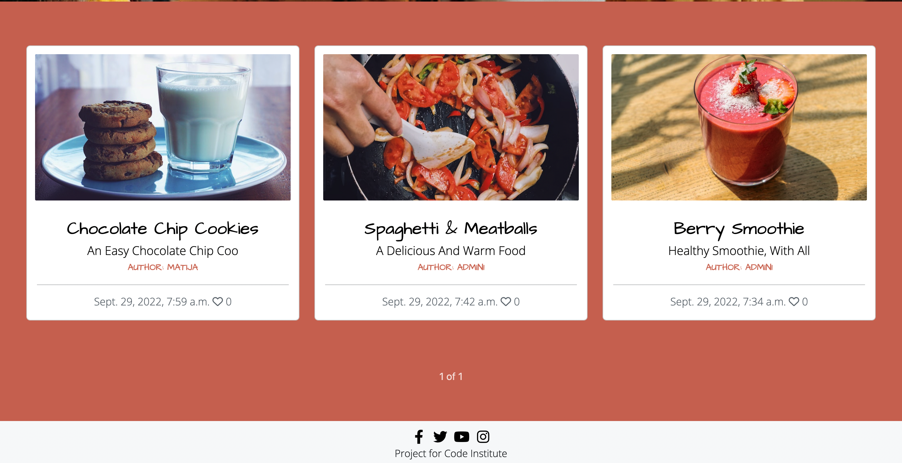

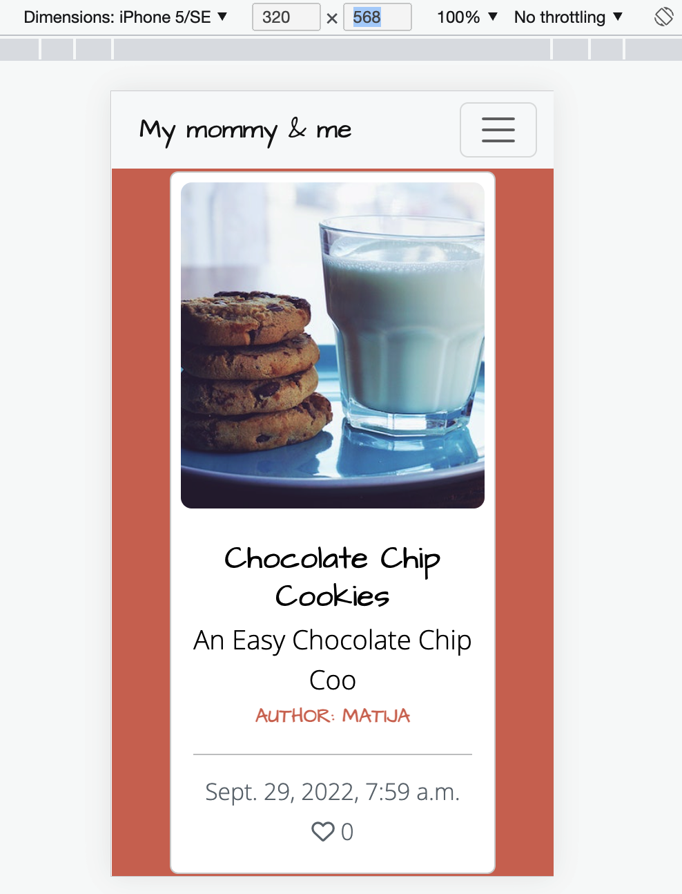

Home page - Recipe Cards:

Each card has the same style: On the top is an image that can be uploaded by the user, or if the user forgets or doesn't have an image, a default image is shown. Then, it ocmes the title of the recipe, the author, and a small description. And at the bottom, it is the date when the post was created or updated, and the number of likes.

* Default image:

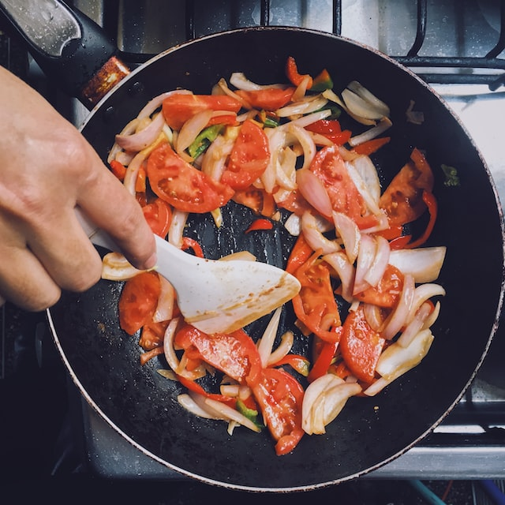

Home page - Site Pagination:

The home page has a limit of 6 posts, if more posts are added, it will appear a pagination nabvar telling in what page is the user, and links for going to the next page or the previous one.

Home page - Footer:

This section has the social media icons from Font Awewsome: Facebook, Twiter, Instagram, and Youtube. Each icon redirects to their respective home page in a new tab. 

- **About page:**

This section is very similar to the home page, but instead of showing a list of recipes for the main content, it is shown a small description about the blog and how the user can be part of it.

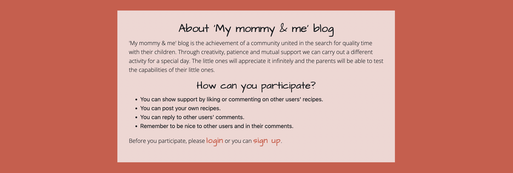

- **Add Recipe:**

After the user is logged in, he has a link on the navbar for adding a recipe. If he clicks on this link, he will be redirected to the page with a form that needs to be completed.
The form has the next required fields to submit the recipe: 

* Title: The user must insert an unique name.
* Slug: The user must insert an unique name as an id for the post (blank spaces or other symbols are n ot allowed.)
* Ingredients: For this field is included the features of SummernoteWidget, and the user is able to customize the ingredients section. The editor has included a toolbar for adding style to the content.
* Instructions: For this field is included the features of SummernoteWidget, and the user is able to customize the instructions section. The editor has included a toolbar for adding style to the content.
* Description: This field is for adding a small description, note or advice for making the recipe.
* Image: The user will be able to upload a photo to display as a main image for the recipe. If the user doesn't 

If the user isn't logged in, but knows the URL for this action, a message is shown as a reminder to login or sign up.

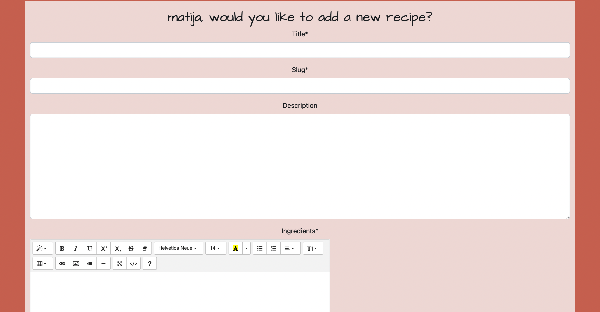

- **Recipe detail page:**

If the user is interested on a recipe from the home page, by clicking on the title of the card, the user is redirected to all details of the recipe.
* At the top is the title of the recipe, then it follows the author of the post and the date when the post was created. 
* Then are two columns, the first one on the left-hand side is the image of the recipe (uploaded by the user or the default image), on the right-hand side is the description of the recipe.
* The ingredients are shown, as the user wanted.
* The instruction section is next.
* Finally, two buttons will appear:  a like/ unlike button and the number of comments button.

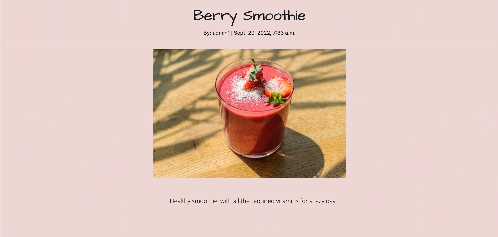

If the user is logged in:
* The user can toggle on the empty heart button for liking a recipe.

* The user can toggle on the full heart button for unliking a recipe.

 Recipe detail page - Comment section:

 After the recipe's details are displaying, it comes the comment section. The comments are shown from newest to oldest.
 * First is the creation date of the comment.
 * Then is the name of the author.
 * The content of the comment.

 If the user is logged in:
 * It will appear a textarea for commenting, in case the user wants.

 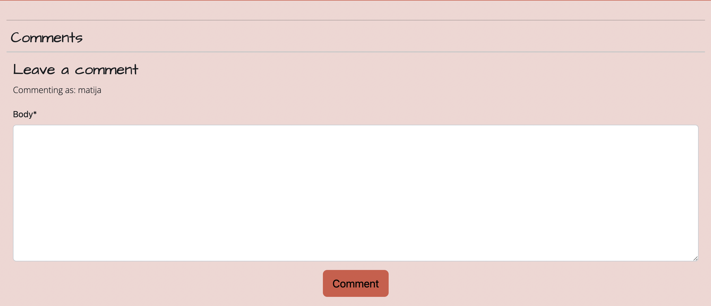

 If the user isn't logged in:
 * It will only appear all the previous comments, and the textarea for commenting is not shown.

  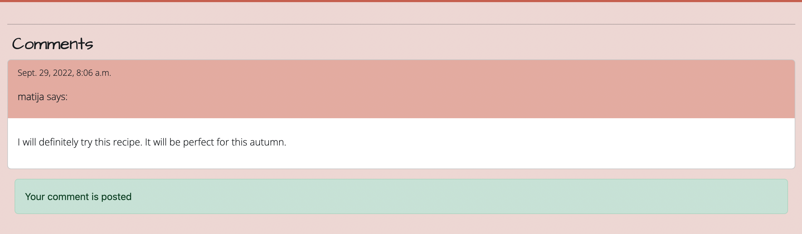

 Recipe detail page - Update and delete recipe:

 If the user is logged in and is the author of the recipe:
 * Two buttons will be shown: Update and Delete buttons.
 * The Update button redirects the user to the update recipe page for any modification.
 * The Delete button redirects the user to a confirmation of action.

  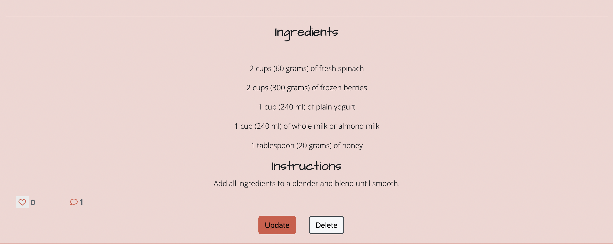

  If the user isn't logged in and isn't the author of the recipe:
  * The buttons are not displayed.

 - **Update Recipe Page**
 On this page, only the owner of the post can make any modification to it, it will show the same form from Summernote with all the fields pre-populated.
After the user modify whatever he wants and submits the recipe, it will be redirected to the home page. If something is not correct, it will stay at the update page with a small warning on the incorrect field.

* If the user didn't update succesfully:

    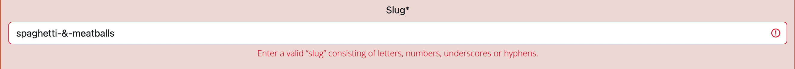

- **Sign Up Page**
To interact with the blog, the user is required to register and login. If the user is not registered, it will be reminded to do it in multiple ways, and he can be redirected by many links on the site.

* Using the navbar link
* Using the link provided on the Login page.
* Using the link provided on the About page.
* Using the link provided on the Update page if the user knows a certain URL.

A new account is created easily. The user needs to complete the following information:

* Username: must be unique.
* E-mail: optional.
* Password: Which must be entered twice.

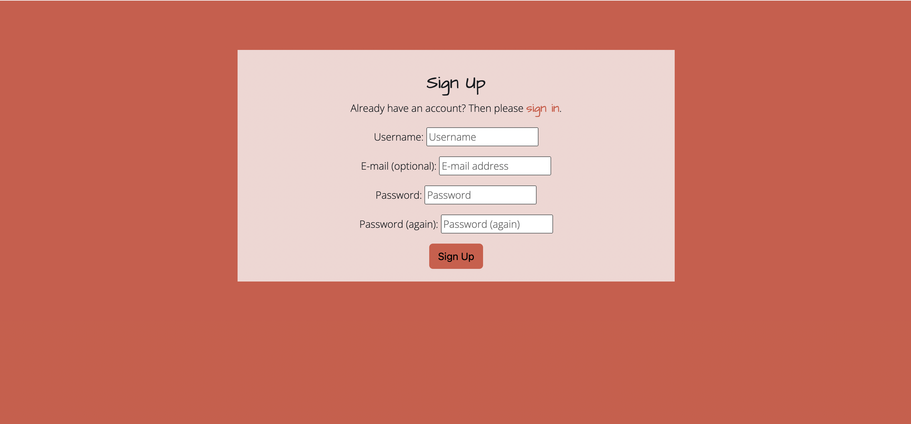

When the user completes all the fields and if the information is valid, the account is created and he's redirected to the Home page.

- **Login Page**

For full CRUD functionality on posted recipes, or the ability to like/unlike a recipe, the user is required to login to the site. The Login page can be accessed by multiple ways:

* Using the navbar link.
* Using the link provided on the Sign up page.
* Using the link provided on the About page.
* Using the link provided on the Update page if the user knows a certain URL.

After the user is registered, the login process is quickly. The user needs to complete the following information:

* Valid username.
* Correct password.

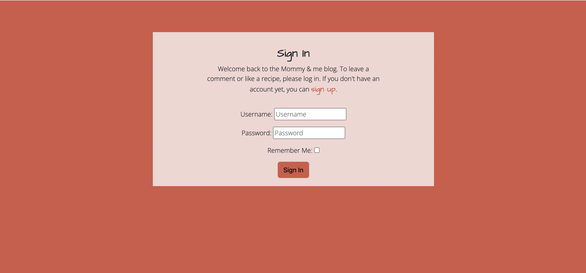

If the user wants, he can ask to be rememeber and avoid repeating the login process. Afrer he submits the information and if it's valid, he will be redirected to the Home page.

- **Logout Page**

The Logout page can be accessed by the navbar link on every page after the user is logged in. When the user clicks on it, he will be redirected to the Logout page for confirming the action. If the user accepts the process, he will go to the Home page, otherwise he will go to the previous page visited.

### Features to Implement in the future

- **Favorite Page**
    - Feature: Every user will have on his profile a section with all their favorite recipe (after liking it) for easy access at any time.  
    - Reason for not featuring in this release: The developer run out of enough time for implementation.
- **Create a Profile Page**
    - Feature: Every user has a profile page that will be created when he registers, this profile can be modified at any time.
    - Reason for not featuring in this release: The developer run out of enough time for implementation.
- **Third-Party Authentication**
    - Feature: The user will have the ability to register with an existent account on a social media, like Facebook or Google.
    - Reason for not featuring in this release: The developer run out of enough time for implementation.

## Issues and Bugs

**Bug:** The add recipe page and the update recipe page uses the Summernote editor where the instructions and ingredients fields have the toolbar for editing; and for small screens, these containers don't get smaller and create an overflow in the page. This bug it wasn't fixed because the developer run out of time.

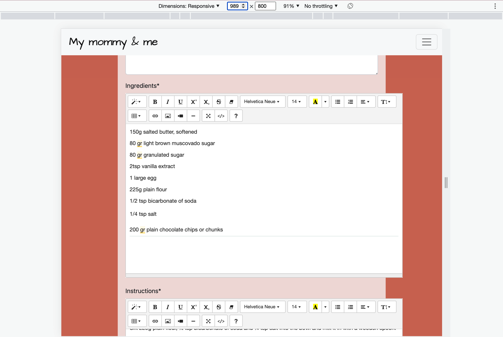

## Technologies Used

### Main Languages Used
- [HTML5](https://en.wikipedia.org/wiki/HTML5 "Link to HTML Wiki")
- [CSS3](https://en.wikipedia.org/wiki/Cascading_Style_Sheets "Link to CSS Wiki")
- [JavaScript](https://en.wikipedia.org/wiki/JavaScript "Link to JavaScript Wiki")
- [Python](https://en.wikipedia.org/wiki/Python_(programming_language) "Link to Python Wiki")

### Frameworks, Libraries & Programs Used
- [Django](https://www.djangoproject.com/ "Link to Django Project website"): Python Framework used in the development of the project.

- [Django Allauth](https://django-allauth.readthedocs.io/en/latest/index.html "Link to django-allauth documentation"): Used for authentication and account registration.

- [Django Crispy Forms](https://django-crispy-forms.readthedocs.io/en/latest/ "Link to django crispy documentation"): Used to simplify the rendering of Django forms.

- [Bootstrap](https://getbootstrap.com/docs/5.0/getting-started/introduction/ "Link to Bootstrap page"): Bootstrap CSS Framework used for styling and to build responsive web pages.

- [Cloudinary](https://cloudinary.com/ "Link to Cloudinary Page"): Used to store all the blog images and the uploaded by the user.

- [Heroku](https://dashboard.heroku.com/ "Link to the Heroku Home Page"): For deployment and hosting of the application.

- [Heroku PostgreSQL](https://www.heroku.com/postgres "Link to the Heroku PostgreSQL Page"): The database used for this application.

- [Summernote](https://summernote.org "Link to Summernote page"): To provide a WYSIWYG editor for customizing new blog content and add images.

- [Google Fonts](https://fonts.google.com/ "Link to Google Fonts"): To import the needed fonts for the project: 'Architects Daughter' and 'Open Sans'.

- [Font Awesome](https://fontawesome.com/ "Link to FontAwesome"): Used to add icons and make the blog more interactive.

- [Git](https://git-scm.com/ "Link to Git homepage"): Used for version control by utilizing the Gitpod terminal to commit to Git and Push to GitHub.

- [GitHub](https://github.com/ "Link to GitHub"): Used to store the projects code after being pushed from Git and to create the Kanban board used for this project.

- [Am I Responsive?](http://ami.responsivedesign.is/# "Link to Am I Responsive Homepage"): Checking the responsive.

- [Google Translate](https://translate.google.com/ "Link to Google Translate"): Checking the grammar when needed after translating from Spanish to English.

- [Coolors](https://coolors.co/ "Link to Coolors"): Program used to check compability of color of the blog.

- [Chrome DevTools](https://developer.chrome.com/docs/devtools/ "Link to developer tools page"): Used to test the response on different screen sizes, debugging and to generate a Lighthouse report to analyze page load.

- [HTML Validator](https://validator.w3.org/): Used to check the code for HTML validation.

- [W3 CSS Validator](https://jigsaw.w3.org/css-validator/): Used to check the code for CSS validation.

- [Unsplah](www.unsplash.com "Link to the home page"): Used image for the blog.

- [Pexels](www.pexels.com "Link to the home page"): Used image for the blog.

## Testing

### Browser Testing

I have tested that this application works using Mackboor Air(Retina, 13-inch, 2020), with macOS Monterey 12.6 installed, using the following browsers.

* Safari Version 16.0 (17614.1.25.9.10, 17614) 
* Google Version 105.0.5195.125 (Official Build) (arm64)

On both browsers, the app keeps functionality without any problem.

### Responsivness

* I have tested that this website works on different screen sizes from iPhone 5(320px wide) and larger screens (5120 x 2880 px).

### Validator Testing

#### W3C Markup Validator: 

The W3C Markup Validator were used to validate the HTML on all pages of the project to ensure there were no syntax errors in there. 
All the results didn't show any error except for the 'Add recipe' and 'Update recipe' pages, after reading the warning messages, it seems that all came with the Summernote editor: the applied style on the html tags.

Home page

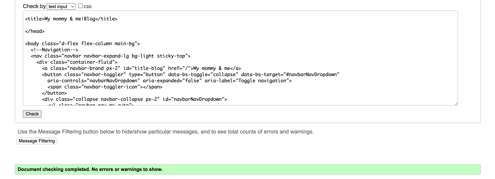

About page:

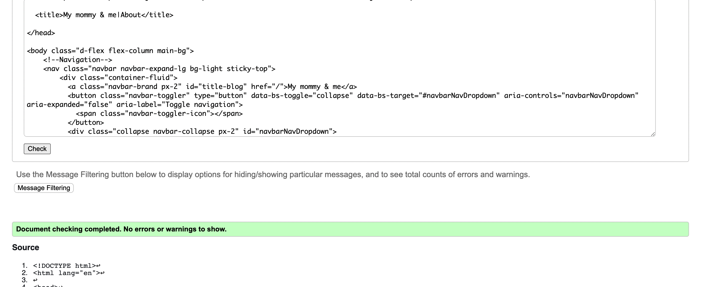

Add Recipe page:

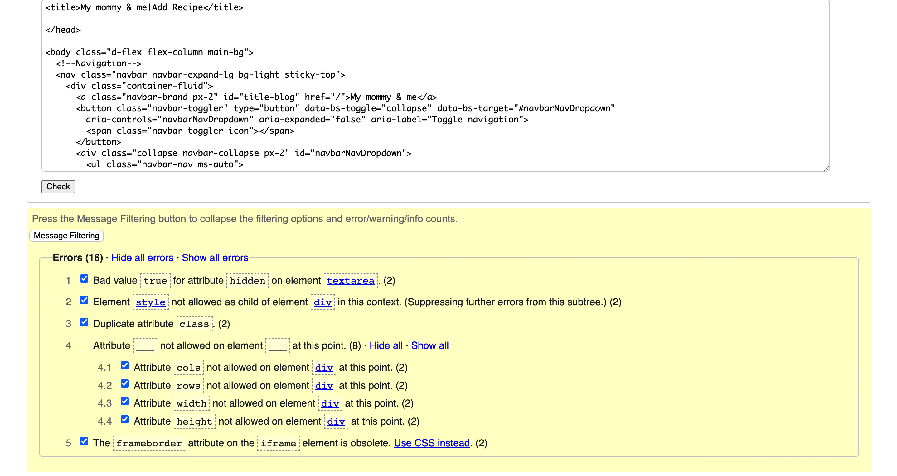

Recipe Detail page:

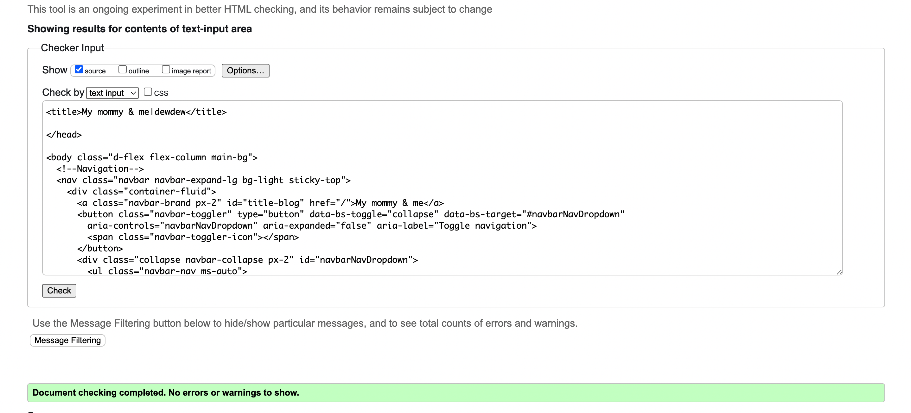

Update Recipe page:

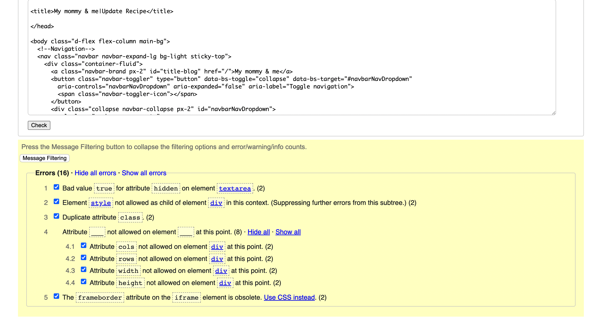

Login page:

Sign up page:

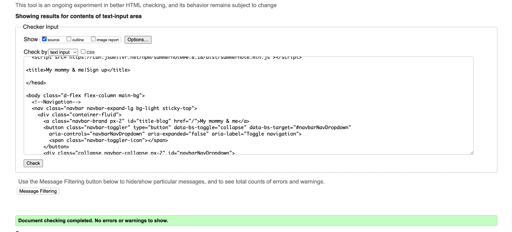

Logout page:

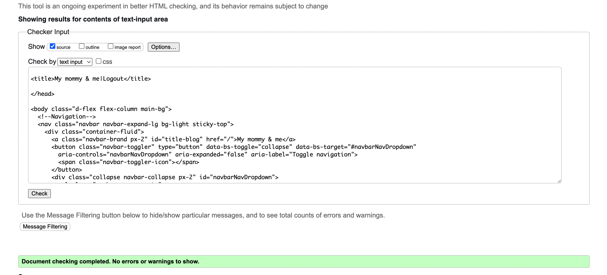

#### W3C CSS Validator:

The W3C CSS Validator Services were used to validate the CSS to ensure there were no errors in there.

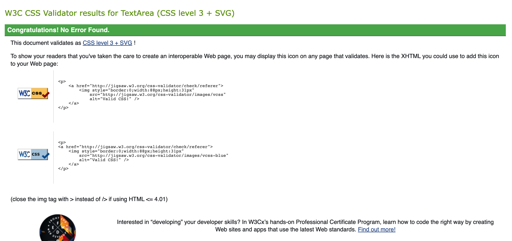

### PEP8 Online:

Python Validator wasn't used to validate all the .py files to ensure there were no errors in there, because the domain has expired.

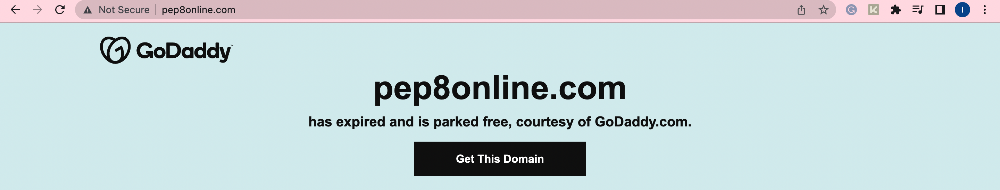

But all the .py files where validated by hand, and using the terminal for problems. After solving all the errrors, there it's only left warning messages that don't affect the performance of the code.

* admin.py

* forms.py

* models.py

* test_forms.py

* test_models.py

* test_views.py

* urls.py

* views.py

### Lighthouse

The Lighthouse performance tests were mande on an incognito tab for Google's recommnedation.

The tests' criterias were:

* Performance
* Accessibility
* Best Practice
* SEO

* Desktop test 

All criterias were passed with more than 90%.

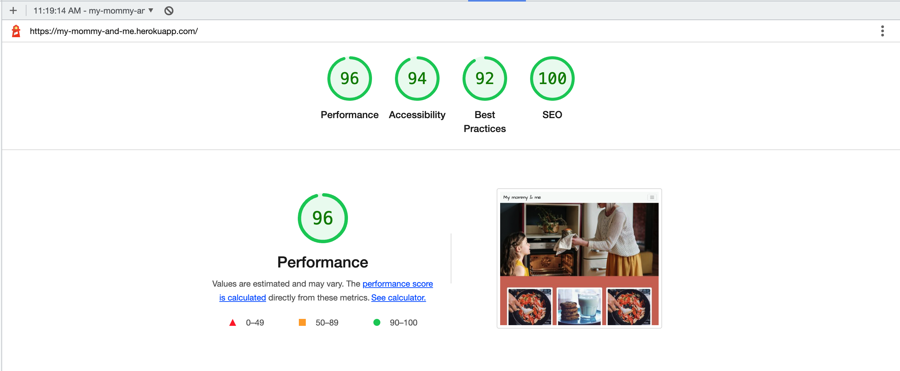

* Mobile test

I did two tests for this option, the first one had a performance score of 76%, where after reading the message I couldn't find a solution, so I tested on a Samnsung Galaxy A32, and it worked perfectly without any problem, then I repeat the test and all the criterias were passed with more than 90%.

* First Test

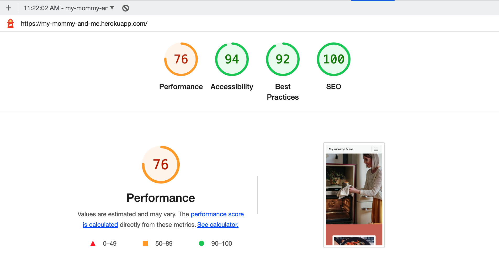

* Second Test

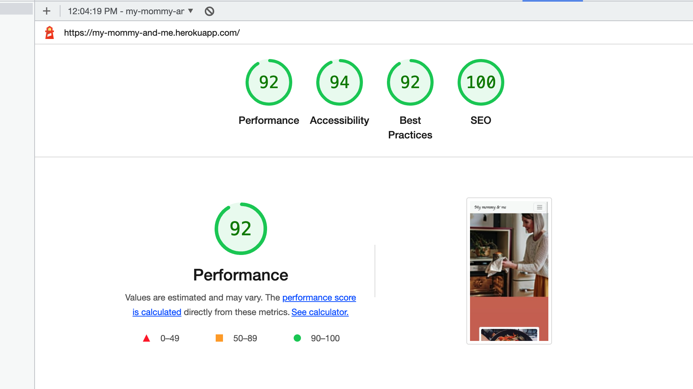

### Automated testing

Django TestCase was used to create automatic tests for Python files. The test reporting tool ’Coverage’ was installed to show the percentage of Python code that’s been covered by tests.

The tests were written on the next files:

* test_forms.py check in [here](https://github.com/iama3191/PP4-CI/blob/main/blog/test_forms.py)
* test_models.py check in [here](https://github.com/iama3191/PP4-CI/blob/main/blog/test_models.py)
* test_views.py check in [here](https://github.com/iama3191/PP4-CI/blob/main/blog/test_views.py)

Coverage test result: After writing 10 tests, the coverage only got to 70% and didn't keep updating even though, every test is passed.

## Deployment

- This project was developed using a [GitPod](https://gitpod.io/ "Link ot GitPod") workspace. 
- The code was commited to [Git](https://git-scm.com/ "Link to Git").
- The code was pushed to [GitHub](https://github.com/ "Link to GitHub") using the terminal.

The regular process for deployment can be found on the CI Cheat Sheet from the Full Stack Framework.

1. How to clone the repository
2. Create Application and Postgres DB on Heroku
3. Configure Cloudinary to host images used by the application
4. Connect the Heroku app to the GitHub repository
5. Final Deployment steps

### How to clone the repository

When you clone a repository, you copy the repository from GitHub.com to your local machine.

1. Go to the https://github.com/iama3191/PP4-CI repository on GitHUb.

2. Click the 'Code' button to the right-hand side, then click HTTPs and copy the link there.

3. Open a GitBash terminal and navigate to the directory where you want to locate the clone.

4. On the command line, type "git clone" then paste in the copied url and press the Enter key to begin the clone process.

5. To install the packages required by the application use the command : pip install -r requirements.txt.

6. When developing and running the application locally set DEBUG=True in the settings.py file.

7. Changes made to the local clone can be pushed back to the repository using the following commands:

* git add filenames (or "." to add all changed files)
* git commit -m "text message describing changes"
* git push

Any changes pushed to the master branch will take effect on the live project once the application is re-deployed from Heroku.

### Create Application and Postgres DB on Heroku

1. Log in to Heroku at www.heroku.com  (create an account if needed).

2. From the Heroku dashboard, click the Create New App button.

3. On the Create New App page, enter a unique name for the application and select region. Then click Create app.

4. On the Application Configuration page for the new app, click on the Resources tab.

5. In the Add-ons search bar enter "Postgres" and select "Heroku Postgres" from the list (click the "Submit Order Form" button on the pop-up dialog.)

6. Next, click on Settings on the Application Configuration page and click on the "Reveal Config Vars" button - check the DATABASE_URL has been automatically set up.

7. Add a new Config Var called DISABLE_COLLECTSTATIC and assign it a value of 1.

8. Add a new Config Var called SECRET_KEY and assign it a value (any random string of letters, digits and symbols.)

9. The settings.py file should be updated to use the DATABASE_URL and SECRET_KEY environment variable values as follows :

    * DATABASES = {'default': dj_database_url.parse(os.environ.get('DATABASE_URL'))}

    * SECRET_KEY = os.environ.get('SECRET_KEY')

10. In Gitpod, in the project terminal window, to initialize the data model in the postgres database, run the command : python3 manage.py migrate

11. Make sure the project requirements.txt file is up to date with all necessary supporting files by entering the command : pip3 freeze --local > requirements.txt

12. Commit and push any local changes to GitHub.

In order to be able to run the application on localhost, add SECRECT_KEY and DATABASE_URL and their values to env.py

### Configure Cloudinary to host images used by the application

1. Log in to Cloudinary - create an account if needed. To create the account provide your name, email and set up a password. For "primary interest" you can choose "Programmable Media for image and video API". Click "Create Account" and you will be sent an email to verify your account and bring you to the dashboard.

2. From the dashboard, copy the "API Environment variable" value by clicking on the "Copy to clipboard" link.

3. Log in to Heroku and go to the Application Configuration page for the application. Click on Settings and click on the "Reveal Config Vars" button.

4. Add a new Config Var called CLOUDINARY_URL and assign it the value copied from the Cloudinary dashboard, but remove the "CLOUDINARY_URL=" at the beginning of the string.

5. In order to be able to run the application on localhost, also add the CLOUDINARY_URL environment variable and value to env.py.

### Connect the Heroku app to the GitHub repository

1. Go to the Application Configuration page for the application on Heroku and click on the Deploy tab.

2. Select GitHub as the Deployment Method and if prompted, confirm that you want to connect to GitHub. Enter the name of the github repository (the one used for this project is (https://github.com/iama3191/PP4-CI) and click on Connect to link up the Heroku app to the GitHub repository code.

3. Scroll down the page and choose to either Automatically Deploy each time changes are pushed to GitHub, or Manually deploy - for this project Manual Deploy was selected.

4. The application can be run from the Application Configuration page by clicking on the Open App button.

The live link for this project is (https://my-mommy-and-me.herokuapp.com/)

### Final Deployment steps

Once code changes have been completed and tested on localhost, the application can be prepared for Heroku deployment as follows:

1. Set DEBUG flag to False in settings.py.

2. Ensure this line exists in settings.py to make summernote work on the deployed environment (CORS security feature): X_FRAME_OPTIONS = 'SAMEORIGIN'.

3. Ensure requirements.txt is up to date using the command : pip3 freeze --local > requirements.txt.

4. Push files to GitHub

5. In the Heroku Config Vars for the application delete this environment variable : DISABLE_COLLECTSTATIC.

6. On the Heroku dashboard go to the Deploy tab for the application and click on deploy branch.

## Credits

* Code Institute Tutor Support: for helping me when I couldn't do it by myself.

* Code Institute: Walkthrough modules in Full Stack Frameworks.

* Code Institute Slack Community: For troubleshooting and FAQ.

*  [Very Academy](https://www.youtube.com/watch?v=GBgRMdjAx_c&t=353s): Django Testing - Model Introduction.

* Django documentation: For clarifying all the doubts

* Stack Overflow: For troubleshooting and FAQ.

* Recipes are from https://www.bbcgoodfood.com/recipes/vintage-chocolate-chip-cookies

### Code

* Code for testing the number of likes of a recipe was from [Very Academy](https://youtu.be/GBgRMdjAx_c?t=974) at minute 16:14.

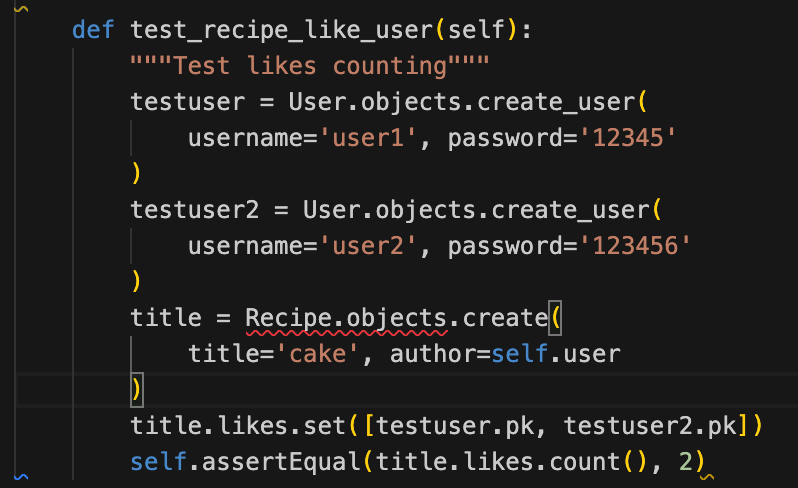

## Acknowledgements

* My mentor at Code Institute, Brian Macharia, for code review, help and feedback.

